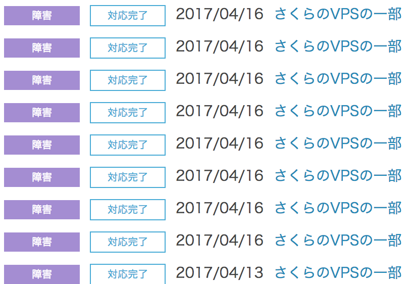

# lilo.linux.or.jp の話 (2017年5月)

author
:   Kazuhiro NISHIYAMA

content-source
:    LILO&東海道らぐオフラインミーティング

date
:   2017/05/06

allotted-time
:   15m

# lilo.linux.or.jp とは?

主な用途:

* LILO の Web サーバー (apache)
* ML サーバー (mailman)

# 環境

* さくらの VPS
* Debian GNU/Linux

# 今回の話

前回以降の話

* Debian 8.7 に更新
  * milter manager の apt-line 変更
* certbot 近況
* sudo 許可 / ssh の接続制限変更
* 障害発生

# Debian 8.7 に更新

* milter manager の apt-line を SF.net から packagecloud.io に更新

# milter manager

* https://milter-manager.osdn.jp/reference/ja/install-to-debian.html にしたがって
  * `curl -s https://packagecloud.io/install/repositories/milter-manager/repos/script.deb.sh | bash`
* 古い apt/sources.list.d/milter-manager.list は削除

# milter-manager.sock のパス修正 (1/2)

* 変更していた設定の再適用
* `/etc/default/milter-manager` で
  * `CONNECTION_SPEC=unix:/var/spool/postfix/milter-manager.sock`
  * `milter-manager/milter-manager.sock` だとディレクトリがなくて問題が起きたはず

# milter-manager.sock のパス修正 (2/2)

* `/etc/postfix/main.cf` では
  `smtpd_milters = unix:/milter-manager.sock`
  のまま

# milter-manager の動作確認

* ssh でログインして自動送信されるメールで確認

# certbot 更新

* RandomizedDelaySec の問題は ExecStartPre で解決していた。
  * https://bugs.debian.org/cgi-bin/bugreport.cgi?bug=843607
* lilo.linux.or.jp は何も追加設定していなかったので単純に更新で解決
  * 対処を入れていた lilo とは関係ない他のサーバーでは対処を削除した

# さらに certbot 更新 (1/3)

* 一時的に python-acme と certbot の依存関係が壊れていた
  * [Letsencrypt-devel] Bug#861269: certbot: Fails to install on jessie-backports
    http://lists.alioth.debian.org/pipermail/letsencrypt-devel/Week-of-Mon-20170424/001298.html
    * python-acme : Breaks: python-certbot (< 0.10.2) but 0.9.3-1~bpo8+2 is to be installed

# さらに certbot 更新 (2/3)

* 待てば解決
  * certbot:all 0.9.3-1~bpo8+2 => 0.10.2-1~bpo8+1
  * python-acme:all 0.9.3-1~bpo8+1 => 0.10.2-1~bpo8+1
  * python-certbot:all 0.9.3-1~bpo8+2 => 0.10.2-1~bpo8+1

# さらに certbot 更新 (3/3)

* 0.9 から 0.10 は機能追加がメインで特に影響があるような変更はなかった
* https://github.com/certbot/certbot/blob/master/CHANGELOG.md
* 今は 0.13.0 - 2017-04-06 が最新
  * 基本的な使い方しかしていないので更新されても影響はなさそう

# certbot 自動更新状況

* 前回の発表(2017-01-07)以降2回の更新あり
  * 2017-02-22 12:11
  * 2017-04-23 12:27
* 有効期限が30日未満になったら自動更新で90日になるので約2ヶ月ごと

# sudo の許可

二要素認証を有効にしているユーザーに sudo を許可

    root@chiyoko:~# ls -al /home/*/.google_authenticator
    -r-------- 1 e****     e****     146  8月 14  2016 /home/e****/.google_authenticator
    -r-------- 1 n******** n******** 129  4月  1 17:49 /home/n********/.google_authenticator
    -r-------- 1 y**       y**       146  8月 15  2016 /home/y**/.google_authenticator
    root@chiyoko:~# adduser n******** sudo
    ユーザ `n********' をグループ `sudo' に追加しています...
    ユーザ n******** をグループ sudo に追加
    完了。
    root@chiyoko:~# adduser e**** sudo
    ユーザ `e****' をグループ `sudo' に追加しています...
    ユーザ e**** をグループ sudo に追加
    完了。
    root@chiyoko:~# adduser y** sudo
    ユーザ `y**' をグループ `sudo' に追加しています...
    ユーザ y** をグループ sudo に追加
    完了。
    root@chiyoko:~# etckeeper commit

# ssh の制限変更 (1/2)

* vi /etc/ssh/sshd_config
  * google_authenticator を設定しているユーザーだけに変更
* service ssh restart
* etckeeper commit
* *ここではまだ root 権限のシェルを閉じない*

# ssh の制限変更 (2/2)

* 接続確認
* vi /etc/pam.d/sshd
  * pam_exec.so の行をコメントアウト
* etckeeper commit
* 接続確認
* ここで root のシェルを exit

# 障害発生 (1/3)

* さくらのVPS の障害でしばらくつながらなくなり再起動
* 自宅サーバーの Zabbix からの監視では
  * 2017-04-16 17:05過ぎ頃から応答なし
  * 2017-04-16 18:30頃に復旧

# 障害発生 (2/3)

- 同じ日に他の IP アドレス範囲でも障害が発生していた
- https://help.sakura.ad.jp/hc/ja/articles/206094022

{:relative_height='100'}

# 障害発生 (3/3)

http://support.sakura.ad.jp/mainte/mainteentry.php?id=21624

   ```
   発生日時 : 2017年04月16日17時10分 - 2017年04月16日18時59分
   影響範囲 : さくらのVPSの一部
              IPアドレスが下記のお客様
              (略)
              133.242.207.124
              (略)
   障害内容 : VPSに接続できなくなる障害が発生しました。
              障害によりお客様ご利用のVPSに意図しない
              再起動が発生しました。
  ---------------------------------------------------------------------
   18時35分 : 影響範囲内の一部VPSに関し、動作の確認に時間がかかっております。
              ご迷惑をお掛けして申し訳ございませんが
              作業終了まで、もうしばらくお待ちください
   18時59分 : 作業が完了し、この障害は復旧しております。
   ```

# まとめ (1/2)

* milter-manager でちょっとひっかかったけど Debian の更新は順調
* certbot は Unknown lvalue 'RandomizedDelaySec' in section 'Timer' 問題が解決

# まとめ (2/2)

* sudo と ssh は google_authenticator を設定している人だけ許可
  * まだの人は VPS のコンソール直接で root 権限で入って権限追加してください
* さくらの障害はまあ仕方がない
